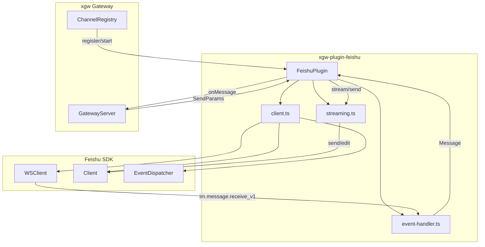

# Design Document: xgw-plugin-feishu

## Overview

飞书渠道插件实现 xgw `ChannelPlugin` 接口，通过飞书 SDK 的 WebSocket 长连接接收消息，并通过 REST API 发送/编辑消息。插件作为独立 npm 包，遵循 TUI plugin 的项目结构模式。

核心设计决策：
- **WebSocket only**：仅使用 `WSClient`，无需公网 IP，部署简单
- **纯文本输出**：v1 不使用 Feishu Card Kit，通过消息编辑实现 streaming
- **独立类型**：本地复制 xgw 类型定义，保持包独立性（与 TUI plugin 一致）
- **最小化**：不实现 pairing 流程、多账号、rich card 等 OpenClaw 特有功能

## Architecture



**入站流程**: WSClient → EventDispatcher → event-handler (解析/过滤) → FeishuPlugin → onMessage → Gateway

**出站流程**: Gateway → FeishuPlugin.send() → StreamingBuffer (if streaming) → Client API (send/edit)

## Components and Interfaces

### 1. `client.ts` — 飞书 SDK 封装

负责创建和管理飞书 SDK 实例。

```typescript
interface FeishuClientOptions {
  appId: string;
  appSecret: string;
  domain?: 'feishu' | 'lark' | string;
}

/** 创建飞书 REST API Client */
function createClient(opts: FeishuClientOptions): Lark.Client;

/** 创建飞书 WebSocket Client */
function createWSClient(opts: FeishuClientOptions, dispatcher: Lark.EventDispatcher): Lark.WSClient;

/** 创建事件分发器 */
function createDispatcher(): Lark.EventDispatcher;

/** 通过获取 tenant_access_token 验证凭证，返回 botOpenId */
function validateCredentials(client: Lark.Client): Promise<{ botOpenId: string }>;
```

设计决策：不做客户端缓存（与 OpenClaw 不同），因为 xgw 插件是单账号模式，生命周期由 `start()`/`stop()` 管理。

### 2. `event-handler.ts` — 事件解析

负责将飞书事件转换为 xgw Message，包含消息内容解析和 @bot 检测。

```typescript
/** 飞书消息事件类型（本地定义） */
interface FeishuMessageEvent {
  sender: {
    sender_id: { open_id?: string; user_id?: string; union_id?: string };
    sender_type?: string;
    tenant_key?: string;
  };
  message: {
    message_id: string;
    root_id?: string;
    parent_id?: string;
    chat_id: string;
    chat_type: 'p2p' | 'group';
    message_type: string;
    content: string;
    mentions?: Array<{ key: string; id: { open_id?: string }; name: string }>;
  };
}

/** 解析消息内容为纯文本 */
function parseMessageContent(content: string, messageType: string): string;

/** 解析 post 富文本为纯文本 */
function parsePostContent(content: string): string;

/** 检测消息是否 @了机器人 */
function checkBotMentioned(event: FeishuMessageEvent, botOpenId?: string): boolean;

/** 从文本中剥离 bot 的 @mention tag */
function stripBotMention(text: string, mentions: FeishuMessageEvent['message']['mentions'], botOpenId?: string): string;

/** 将飞书事件转换为 xgw Message */
function toMessage(channelId: string, event: FeishuMessageEvent, botOpenId?: string): Message;
```

**parseMessageContent 策略**：
- `text`: JSON.parse → 取 `.text` 字段
- `post`: JSON.parse → 递归遍历 `content` 数组中的段落和元素，提取 `tag === 'text'` 的 `.text` 字段，段落间用 `\n` 连接
- `image`: 返回 `[image]`
- `file`: JSON.parse → 返回 `[file: <file_name>]`
- 其他: 返回 `[unsupported: <type>]`
- JSON 解析失败: 返回空字符串 `''`

**session_id 策略**：
- `p2p`: `sender.sender_id.open_id`（每个用户独立会话）
- `group`: `message.chat_id`（每个群独立会话）

**@bot mention 剥离**：遍历 `mentions` 数组，找到 bot 的 mention `key`（如 `@_user_1`），从文本中移除该 key 对应的占位符。

### 3. `streaming.ts` — Streaming 缓冲

管理 streaming 消息的累积、合并编辑和生命周期。

```typescript
interface StreamingSession {
  messageId: string | null;   // 初始消息的 message_id（首次 chunk 后设置）
  buffer: string;             // 累积的完整文本
  timer: ReturnType<typeof setTimeout> | null;  // 合并定时器
  lastEditTime: number;       // 上次编辑时间戳
}

interface StreamingBufferOptions {
  coalesceMs: number;         // 合并间隔，默认 500ms
  sendMessage: (sessionId: string, text: string) => Promise<string>;  // 发送消息，返回 message_id
  editMessage: (messageId: string, text: string) => Promise<void>;    // 编辑消息
}

class StreamingBuffer {
  constructor(options: StreamingBufferOptions);

  /** 处理 streaming chunk */
  async handleChunk(sessionId: string, text: string): Promise<void>;

  /** 处理 streaming end */
  async handleEnd(sessionId: string, text: string): Promise<void>;

  /** 清理所有 session */
  clear(): void;
}
```

**合并逻辑**：
1. 首次 `chunk`: 调用 `sendMessage` 发送初始占位消息（如 `"▍"`），记录 `messageId`
2. 后续 `chunk`: 累积 `text` 到 `buffer`，如果距上次编辑超过 `coalesceMs`，立即编辑；否则设置定时器
3. `end`: 清除定时器，用完整 `text` 做最终编辑，删除 session

**Fallback**: 编辑失败时 log 错误，尝试发送新消息。

### 4. `index.ts` — FeishuPlugin 主类

组装以上模块，实现 `ChannelPlugin` 接口。

```typescript
class FeishuPlugin {
  readonly type = 'feishu';

  private client: Lark.Client | null = null;
  private wsClient: Lark.WSClient | null = null;
  private streamingBuffer: StreamingBuffer | null = null;
  private channelId = '';
  private botOpenId?: string;
  private config: FeishuPluginConfig | null = null;

  async pair(config: ChannelConfig): Promise<PairResult>;
  async start(config: ChannelConfig, onMessage: (msg: Message) => Promise<void>): Promise<void>;
  async stop(): Promise<void>;
  async send(params: SendParams): Promise<void>;
  async health(): Promise<HealthResult>;
}
```

## Data Models

### FeishuPluginConfig（从 ChannelConfig 提取）

```typescript
interface FeishuPluginConfig {
  appId: string;
  appSecret: string;
  domain: 'feishu' | 'lark' | string;       // 默认 'feishu'
  requireMention: boolean;                    // 默认 true
  streamingCoalesceMs: number;                // 默认 500
}
```

### FeishuMessageEvent（本地类型定义）

```typescript
interface FeishuMessageEvent {
  sender: {
    sender_id: {
      open_id?: string;
      user_id?: string;
      union_id?: string;
    };
    sender_type?: string;
    tenant_key?: string;
  };
  message: {
    message_id: string;
    root_id?: string;
    parent_id?: string;
    chat_id: string;
    chat_type: 'p2p' | 'group';
    message_type: string;
    content: string;
    mentions?: Array<{
      key: string;
      id: { open_id?: string };
      name: string;
    }>;
  };
}
```

### StreamingSession（内部状态）

```typescript
interface StreamingSession {
  messageId: string | null;
  buffer: string;
  timer: ReturnType<typeof setTimeout> | null;
  lastEditTime: number;
}
```

### 本地复制的 xgw 类型

与 TUI plugin 一致，在 `src/index.ts` 中本地定义 `Message`、`SendParams`、`HealthResult`、`PairResult`、`ChannelConfig`、`Attachment` 类型，保持包独立性。


## Correctness Properties

*A property is a characteristic or behavior that should hold true across all valid executions of a system — essentially, a formal statement about what the system should do. Properties serve as the bridge between human-readable specifications and machine-verifiable correctness guarantees.*

### Property 1: Text content round-trip

*For any* non-empty string `s`, wrapping it as `JSON.stringify({ text: s })` and calling `parseMessageContent(wrapped, 'text')` SHALL return the original string `s`.

**Validates: Requirements 3.1**

### Property 2: Post content text extraction

*For any* valid post content structure containing text nodes, `parsePostContent` SHALL produce output that contains every text node's `.text` value from the input.

**Validates: Requirements 3.2**

### Property 3: Placeholder format for non-text types

*For any* message type that is not `text` or `post`:
- If type is `image`, `parseMessageContent` returns exactly `[image]`
- If type is `file` with filename `f`, `parseMessageContent` returns `[file: f]`
- For any other type `t`, `parseMessageContent` returns `[unsupported: t]`

**Validates: Requirements 3.3, 3.4, 3.5**

### Property 4: Malformed JSON safety

*For any* string that is not valid JSON, `parseMessageContent(s, 'text')` SHALL return an empty string and SHALL NOT throw an error.

**Validates: Requirements 3.6**

### Property 5: Bot mention detection correctness

*For any* FeishuMessageEvent and botOpenId, `checkBotMentioned(event, botOpenId)` returns `true` if and only if `event.message.mentions` contains an entry whose `id.open_id` equals `botOpenId`.

**Validates: Requirements 4.1, 4.2, 4.5**

### Property 6: Bot mention stripping

*For any* message text containing a bot mention key (e.g. `@_user_1`), `stripBotMention` SHALL produce output that does not contain the bot's mention key placeholder, while preserving all other text content.

**Validates: Requirements 4.4**

### Property 7: Session ID routing

*For any* FeishuMessageEvent, `toMessage` SHALL set `session_id` to `sender.sender_id.open_id` when `chat_type` is `'p2p'`, and to `message.chat_id` when `chat_type` is `'group'`.

**Validates: Requirements 5.1, 5.2**

### Property 8: Streaming buffer accumulation

*For any* sequence of `handleChunk` calls with texts `[t1, t2, ..., tn]` for the same session, the buffer's accumulated text SHALL equal the last provided text (since `SendParams.text` contains the full accumulated text from the gateway, not incremental tokens).

**Validates: Requirements 7.2**

## Error Handling

| 场景 | 处理方式 | 相关需求 |
|------|---------|---------|
| 飞书凭证无效（pair） | 返回 `{ success: false, error: '...' }`，不抛异常 | 1.2 |
| 飞书凭证无效（start） | 抛出 Error，由 ChannelRegistry 捕获并记录 | 2.1 |
| WebSocket 断线 | SDK 内置自动重连，无需额外处理 | 2.1 |
| 消息内容 JSON 解析失败 | 返回空字符串 `''`，不抛异常 | 3.6 |
| 消息发送 API 失败 | `send()` 抛出 Error，由调用方处理 | 6.1 |
| Streaming 编辑 API 失败 | 记录日志，尝试发送新消息作为 fallback | 7.5 |
| 不支持的消息类型 | 返回 `[unsupported: type]` 占位符 | 3.5 |
| `stop()` 时 WSClient 未启动 | 静默返回，不抛异常 | 2.4 |

## Testing Strategy

### 测试框架

- **单元测试**: vitest
- **属性测试**: fast-check + vitest
- **测试文件位置**: `vitest/unit/` 和 `vitest/pbt/`

### 双重测试策略

**单元测试**（具体示例和边界情况）：
- `event-handler.test.ts`: 各消息类型解析的具体示例、@bot 检测的具体场景、bot 消息过滤
- `streaming.test.ts`: streaming 生命周期（首次 chunk → 后续 chunk → end）、编辑失败 fallback、清理行为
- `index.test.ts`: pair 成功/失败、health 状态、config 解析默认值

**属性测试**（通用属性验证）：
- `message-parsing.pbt.test.ts`: Property 1-4（消息内容解析的各种属性）
- `bot-mention.pbt.test.ts`: Property 5-6（@bot 检测和剥离）
- `session-routing.pbt.test.ts`: Property 7（session_id 路由）
- `streaming.pbt.test.ts`: Property 8（streaming buffer 累积）

### 属性测试配置

- 库: `fast-check`
- 每个属性测试最少 100 次迭代
- 每个测试用注释标注对应的设计文档属性编号
- 标注格式: `Feature: feishu-plugin, Property N: <property_text>`
