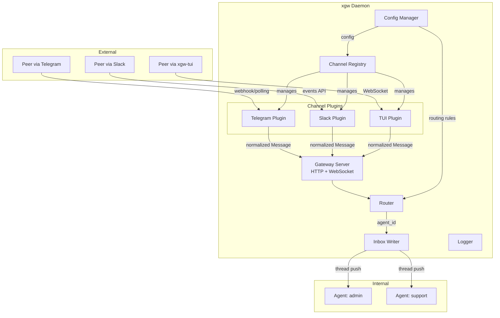

# Design Document: xgw-gateway

## Overview

xgw is a communication gateway daemon and CLI for TheClaw. It bridges external IM channels and internal agents by routing inbound messages to agent inboxes and delivering outbound replies back through channels. The system is built around a plugin architecture where each IM channel type is an independent plugin, and a YAML-based configuration drives routing, channel, and agent management.

The implementation uses TypeScript + ESM, with `commander` for CLI parsing, `ws` for WebSocket, Node built-in `http` for the gateway server, `js-yaml` for configuration, and `vitest` for testing.

## Architecture



### Outbound Flow


### Key Architectural Decisions

1. **Plugin isolation**: The gateway core has zero knowledge of channel-specific protocols. All normalization (raw → Message) and reverse normalization (params → API call) happens inside plugins.
2. **Config-driven**: All state (channels, routes, agents) lives in a single YAML config file. No database dependency.
3. **Process model**: Single daemon process. Channel plugins run as in-process modules (not separate processes).
4. **CLI-first management**: All management operations (route/channel/agent CRUD) are CLI commands that mutate the config file and signal the daemon to reload.

## Components and Interfaces

### 1. CLI Entry Point (`src/index.ts`)

The main entry point using `commander` to parse and dispatch CLI commands.

```typescript
// Commands:
// xgw start [--config <path>] [--foreground]
// xgw stop [--config <path>]
// xgw status [--config <path>] [--json]
// xgw send --channel <id> --peer <id> --session <id> --message <text> [--reply-to <id>] [--config <path>] [--json]
// xgw reload [--config <path>]
// xgw config check [--config <path>]
// xgw route add|remove|list [options]
// xgw channel add|remove|list|health|pair [options]
// xgw agent add|remove|list [options]
```

Each command is implemented in a separate file under `src/commands/`. The entry point resolves the config path using the precedence: `--config` flag > `XGW_CONFIG` env > default `~/.config/xgw/config.yaml`.

### 2. Config Manager (`src/config.ts`)

Responsible for loading, validating, mutating, and serializing the YAML configuration.

```typescript
interface GatewayConfig {
  host: string;
  port: number;
}

interface ChannelConfig {
  id: string;
  type: string;
  paired?: boolean;
  pair_mode?: 'webhook' | 'polling' | 'ws';
  pair_info?: Record<string, string>;
  paired_at?: string;
  [key: string]: unknown; // channel-specific fields (token, port, etc.)
}

interface RoutingRule {
  channel: string;
  peer: string;
  agent: string;
}

interface AgentConfig {
  id: string;
  inbox: string;
}

interface Config {
  gateway: GatewayConfig;
  channels: ChannelConfig[];
  routing: RoutingRule[];
  agents: Record<string, { inbox: string }>;
}

// Core functions:
function loadConfig(configPath: string): Config;
function validateConfig(config: Config): ValidationResult;
function saveConfig(configPath: string, config: Config): void;
function resolveConfigPath(cliFlag?: string): string;
```

Validation checks:
- Required fields present (`gateway.host`, `gateway.port`, `channels`, `routing`, `agents`)
- Type correctness for each field
- Channel ids are unique
- Routing rules reference existing channels and agents
- Agent inbox paths are non-empty strings

### 3. Gateway Server (`src/gateway/server.ts`)

The HTTP + WebSocket server that the daemon runs. Provides webhook endpoints for channel plugins that use webhook mode.

```typescript
interface GatewayServer {
  start(config: Config, registry: ChannelRegistry): Promise<void>;
  stop(): Promise<void>;
  getStats(): GatewayStats;
}

interface GatewayStats {
  uptime: number;
  messagesIn: number;
  messagesOut: number;
  channelStats: Record<string, { status: string; messagesIn: number; messagesOut: number }>;
}
```

### 4. Router (`src/gateway/router.ts`)

Maps `(channel_id, peer_id)` to `agent_id` using configured routing rules.

```typescript
interface Router {
  resolve(channelId: string, peerId: string): string | null;
  reload(rules: RoutingRule[]): void;
}
```

Resolution algorithm:
1. Find all rules matching `channel_id`
2. Among those, prefer exact `peer_id` match over wildcard `*`
3. Return the `agent_id` of the best match, or `null` if no match

### 5. Inbox Writer (`src/inbox.ts`)

Writes normalized messages to agent inbox threads via `thread push`.

```typescript
interface InboxWriter {
  push(agentId: string, message: Message, agentsConfig: Record<string, { inbox: string }>): Promise<void>;
}
```

Executes:
```bash
thread push --thread <inbox_path> --source <source_address> --type message --content <JSON(message)>
```

Source address format: `external:<channel_type>:<channel_id>:<session_type>:<session_id>:<peer_id>`

### 6. Channel Registry (`src/channels/registry.ts`)

Manages channel plugin lifecycle: loading, starting, stopping.

```typescript
interface ChannelRegistry {
  register(type: string, plugin: ChannelPlugin): void;
  loadPlugins(channels: ChannelConfig[]): Promise<void>;
  startAll(channels: ChannelConfig[], onMessage: (msg: Message) => Promise<void>): Promise<void>;
  stopAll(): Promise<void>;
  getPlugin(channelId: string): ChannelPlugin | undefined;
  healthCheck(channelId?: string): Promise<Record<string, HealthResult>>;
}
```

### 7. Channel Plugin Interface (`src/channels/types.ts`)

```typescript
interface Message {
  id: string;
  channel_id: string;
  peer_id: string;
  peer_name: string | null;
  session_id: string;
  text: string;
  attachments: Attachment[];
  reply_to: string | null;
  created_at: string;
  raw: object;
}

interface Attachment {
  type: string;
  url: string;
  name?: string;
  size?: number;
}

interface ChannelPlugin {
  readonly type: string;
  pair(config: ChannelConfig): Promise<PairResult>;
  start(config: ChannelConfig, onMessage: (msg: Message) => Promise<void>): Promise<void>;
  stop(): Promise<void>;
  send(params: SendParams): Promise<void>;
  health(): Promise<HealthResult>;
}

interface PairResult {
  success: boolean;
  pair_mode: 'webhook' | 'polling' | 'ws';
  pair_info: Record<string, string>;
  error?: string;
}

interface SendParams {
  peer_id: string;
  session_id: string;
  text: string;
  reply_to?: string;
}

interface HealthResult {
  ok: boolean;
  detail?: string;
}
```

### 8. Send Handler (`src/gateway/send.ts`)

Implements the outbound delivery logic for `xgw send`.

```typescript
interface SendHandler {
  send(channelId: string, params: SendParams, registry: ChannelRegistry): Promise<SendResult>;
}

interface SendResult {
  success: boolean;
  channel_id: string;
  peer_id: string;
  error?: string;
}
```

### 9. Logger (`src/logger.ts`)

Structured logging with rotation.

```typescript
interface Logger {
  info(message: string): void;
  warn(message: string): void;
  error(message: string): void;
  setForeground(enabled: boolean): void;
}
```

Log format: `[<ISO8601>] [<LEVEL>] <message>`
Rotation: when file exceeds 10000 lines, rotate to `xgw-<YYYYMMDD-HHmmss>.log`.

### 10. TUI Plugin (`plugins/tui/src/index.ts`)

WebSocket-based channel plugin for local terminal chat.

```typescript
// Implements ChannelPlugin interface
// WebSocket JSON protocol:
type TuiFrame =
  | { type: 'hello'; channel_id: string; peer_id: string }
  | { type: 'hello_ack'; channel_id: string; peer_id: string }
  | { type: 'error'; code: string; message: string }
  | { type: 'message'; text: string }
  | { type: 'ping' }
  | { type: 'pong' };
```

Connection lifecycle:
1. Client connects via WebSocket
2. Client sends `hello` with `channel_id` and `peer_id`
3. Plugin validates and responds with `hello_ack` or `error`
4. Bidirectional `message` frames for chat
5. `ping`/`pong` for keepalive (30s interval)

Message normalization mapping:
- `id` → UUID generated by plugin
- `channel_id` → from hello handshake
- `peer_id` → from hello handshake
- `peer_name` → same as `peer_id`
- `session_id` → same as `peer_id` (DM mode)
- `text` → from message frame
- `attachments` → `[]`
- `reply_to` → `null`
- `created_at` → ISO 8601 timestamp
- `raw` → original WebSocket JSON frame

Source address: `external:tui:<channel_id>:dm:<peer_id>:<peer_id>`

### 11. XGW-TUI Client (`clients/tui/src/index.ts`)

Terminal chat client using readline and WebSocket.

```typescript
// CLI: xgw-tui --channel <id> --peer <id> [--host <host>] [--port <port>]
// Defaults: host=127.0.0.1, port=18791
```

Behavior:
- Connect to TUI plugin WebSocket, send `hello`, wait for `hello_ack`
- Enter readline loop: user input → `message` frame
- Incoming `message` frames → print with `agent> ` prefix
- Send `ping` every 30s
- `/quit` or Ctrl+C → close and exit
- On disconnect: retry up to 3 times with exponential backoff (1s, 2s, 4s), then exit code 1

## Data Models

### Config YAML Schema

```yaml
gateway:
  host: string        # Listen address (default: 127.0.0.1)
  port: number        # Listen port (default: 18790)

channels:
  - id: string        # Unique channel identifier
    type: string      # Plugin type (telegram, slack, tui, webchat, etc.)
    paired: boolean   # Whether channel has been paired
    pair_mode: string  # webhook | polling | ws
    pair_info: object  # Channel-specific pair info
    paired_at: string  # ISO 8601 timestamp
    # ... channel-specific fields (token, port, etc.)

routing:
  - channel: string   # Channel ID or "*"
    peer: string      # Peer ID or "*" (wildcard)
    agent: string     # Target agent ID

agents:
  <agent_id>:
    inbox: string     # Path to agent's inbox thread
```

### Internal Message Structure

As defined in the Components section — the `Message` interface is the canonical internal representation. All channel plugins normalize inbound messages into this structure and reverse-normalize outbound parameters into channel-specific API calls.

### File System Layout (Runtime)

```
~/.config/xgw/
└── config.yaml              # Configuration file

~/.local/share/xgw/
├── logs/
│   ├── xgw.log              # Current log
│   └── xgw-*.log            # Rotated logs
└── xgw.pid                  # Daemon PID file
```

### Exit Codes

| Code | Meaning |
|------|---------|
| 0 | Success |
| 1 | Logic error (config error, send failure, missing resource) |
| 2 | Usage/argument error (missing args, invalid flags) |

### Environment Variables

| Variable | Description | Default |
|----------|-------------|---------|
| `XGW_CONFIG` | Config file path | `~/.config/xgw/config.yaml` |
| `XGW_HOME` | Data directory root | `~/.local/share/xgw` |


## Correctness Properties

*A property is a characteristic or behavior that should hold true across all valid executions of a system — essentially, a formal statement about what the system should do. Properties serve as the bridge between human-readable specifications and machine-verifiable correctness guarantees.*

### Property 1: Config path resolution precedence

*For any* combination of `--config` flag value, `XGW_CONFIG` environment variable, and default path, `resolveConfigPath` SHALL return the highest-precedence non-empty value in the order: flag > env > default.

**Validates: Requirements 1.1**

### Property 2: Config validation rejects invalid configs

*For any* Config object with one or more required fields missing or incorrectly typed, `validateConfig` SHALL return a failure result identifying the invalid fields.

**Validates: Requirements 1.2**

### Property 3: Config mutation round-trip

*For any* valid Config object, mutating it (adding/removing a channel, route, or agent), saving to YAML, and reloading SHALL produce a Config equivalent to the mutated version.

**Validates: Requirements 1.5, 14.3**

### Property 4: Config YAML round-trip

*For any* valid Config object, serializing to YAML then parsing back SHALL produce an equivalent Config object.

**Validates: Requirements 14.3**

### Property 5: Config comment preservation

*For any* YAML config file containing comments, performing a CLI-driven mutation (add/remove channel, route, or agent) and saving SHALL preserve the original comments in the output file.

**Validates: Requirements 14.4**

### Property 6: Channel registry starts only paired channels

*For any* set of channel configurations with mixed `paired` status, `startAll` SHALL call `start()` only on channels where `paired` is `true`, and the count of started channels SHALL equal the count of paired channels.

**Validates: Requirements 3.3**

### Property 7: Channel registry stops all running plugins

*For any* set of running channel plugins, `stopAll` SHALL call `stop()` on every plugin that was previously started, leaving zero running plugins.

**Validates: Requirements 3.4**

### Property 8: Router resolves to most specific match

*For any* routing table containing both exact `(channel, peer)` rules and wildcard `(channel, *)` rules, and any inbound message whose `(channel_id, peer_id)` matches both an exact rule and a wildcard rule, the Router SHALL return the agent from the exact rule.

**Validates: Requirements 5.1, 5.2, 5.5**

### Property 9: Router returns null for unmatched messages

*For any* routing table and any inbound message whose `(channel_id, peer_id)` does not match any rule (exact or wildcard), the Router SHALL return `null`.

**Validates: Requirements 5.4**

### Property 10: Route add inserts before wildcards

*For any* routing table containing wildcard fallback rules (`peer: "*"`), adding a new exact rule SHALL place it before all wildcard rules in the list.

**Validates: Requirements 7.1**

### Property 11: Route add updates existing duplicate

*For any* routing table and a new rule with the same `(channel, peer)` as an existing rule, `routeAdd` SHALL update the existing rule's agent rather than creating a duplicate, and the total rule count SHALL remain unchanged.

**Validates: Requirements 7.2**

### Property 12: Route remove deletes the matching rule

*For any* routing table containing a rule with `(channel, peer)`, `routeRemove` SHALL produce a table that no longer contains that rule, and the total rule count SHALL decrease by one.

**Validates: Requirements 7.3**

### Property 13: Route list is sorted by match priority

*For any* routing table, `routeList` SHALL return rules sorted so that all exact-peer rules appear before wildcard-peer rules.

**Validates: Requirements 7.5**

### Property 14: Agent add/update registers inbox correctly

*For any* agent id and inbox path, after `agentAdd`, the config SHALL contain that agent with the specified inbox path — whether the agent was new or already existed.

**Validates: Requirements 8.1, 8.2**

### Property 15: Agent remove deletes registration

*For any* config containing an agent with no routing rules referencing it, `agentRemove` SHALL produce a config that no longer contains that agent.

**Validates: Requirements 8.3**

### Property 16: Channel add creates new entry

*For any* channel id and type not already in the config, `channelAdd` SHALL produce a config containing a new channel entry with that id and type.

**Validates: Requirements 4.1**

### Property 17: Channel remove cleans up config

*For any* config containing a channel, `channelRemove` SHALL produce a config that no longer contains that channel entry.

**Validates: Requirements 4.4**

### Property 18: TUI Plugin message normalization

*For any* valid WebSocket message frame with arbitrary text content, the TUI Plugin SHALL normalize it into a Message object where: `id` is a valid UUID, `channel_id` and `peer_id` match the handshake values, `session_id` equals `peer_id`, `text` equals the frame text, `attachments` is empty, `created_at` is a valid ISO 8601 timestamp, and `raw` contains the original frame.

**Validates: Requirements 9.1, 9.2, 9.4, 10.4**

### Property 19: TUI Plugin hello handshake

*For any* valid `peer_id` and `channel_id`, sending a `hello` frame to the TUI Plugin SHALL result in a `hello_ack` response with matching `channel_id` and `peer_id`.

**Validates: Requirements 10.2**

### Property 20: TUI Plugin invalid hello rejection

*For any* malformed hello frame (missing `channel_id`, missing `peer_id`, or unknown `channel_id`), the TUI Plugin SHALL respond with an `error` frame with code `bad_hello`.

**Validates: Requirements 10.3**

### Property 21: TUI Plugin send routes to correct peer

*For any* set of connected clients with distinct `peer_id` values, calling `send()` with a target `peer_id` SHALL deliver the message only to the WebSocket connection associated with that `peer_id`.

**Validates: Requirements 10.5**

### Property 22: Send handler dispatches to correct plugin

*For any* valid channel id present in the registry and any send parameters, the Send Handler SHALL invoke `send()` on the plugin registered for that channel id.

**Validates: Requirements 6.1**

### Property 23: XGW-TUI agent message formatting

*For any* message text received from the TUI Plugin, the XGW-TUI client SHALL format it with the prefix `agent> ` followed by the message text.

**Validates: Requirements 11.3**

### Property 24: XGW-TUI reconnection backoff

*For any* reconnection attempt number n (1 ≤ n ≤ 3), the backoff delay SHALL equal 2^(n-1) seconds (1s, 2s, 4s), and no more than 3 attempts SHALL be made.

**Validates: Requirements 11.5**

### Property 25: Log entry format

*For any* log level and message string, the Logger SHALL produce output matching the pattern `[<ISO8601>] [<LEVEL>] <message>` where the timestamp is valid ISO 8601 and LEVEL is one of INFO, WARN, ERROR.

**Validates: Requirements 12.1**

### Property 26: Log event fields

*For any* inbound event, the log line SHALL contain channel, peer, agent, and message id. *For any* outbound event, the log line SHALL contain channel, peer, and session. *For any* routing miss, the log line SHALL contain channel and peer and use WARN level.

**Validates: Requirements 12.4, 12.5, 12.6**

### Property 27: Error message format

*For any* error condition, the CLI error output SHALL match the pattern `Error: <description> - <remediation>`.

**Validates: Requirements 13.4**

### Property 28: XGW-TUI connection status format

*For any* channel id and peer id, the connection status message SHALL be formatted as `[<channel>/<peer>] Connected.`.

**Validates: Requirements 11.7**

## Error Handling

### Configuration Errors

- Missing or unreadable config file → exit code 1, stderr: `Error: Config file not found at <path> - Create the file or specify a valid path with --config`
- Invalid YAML syntax → exit code 1, stderr: `Error: Invalid YAML syntax in <path> - Check syntax at line <n>`
- Missing required fields → exit code 1, stderr: `Error: Missing required field <field> in config - Add the field to your config file`
- Invalid field types → exit code 1, stderr: `Error: Field <field> has invalid type (expected <type>) - Fix the value in your config file`

### Channel Errors

- Channel plugin not found for type → exit code 1, stderr: `Error: No plugin found for channel type <type> - Install the plugin or check the type name`
- Channel start failure → log error, continue starting other channels (no exit)
- Channel send failure → exit code 1, stderr: `Error: Failed to send message via channel <id> - Check channel health with 'xgw channel health'`
- Duplicate channel id on add → exit code 1, stderr: `Error: Channel <id> already exists - Remove it first with 'xgw channel remove'`

### Routing Errors

- No matching route for inbound message → log warning `routing miss: channel=<id> peer=<id> (no matching rule)`, discard message
- Route not found on remove → exit code 1, stderr: `Error: No route found for channel=<channel> peer=<peer> - Check routes with 'xgw route list'`

### Agent Errors

- Agent referenced by routes on remove → exit code 1, stderr: `Error: Agent <id> is referenced by routing rules - Remove the routes first`
- Agent inbox path not accessible → log warning on message delivery, continue operation

### Daemon Errors

- Daemon already running on start → exit code 1, stderr: `Error: Daemon already running (PID <pid>) - Stop it first with 'xgw stop'`
- Daemon not running on stop → exit code 0 (idempotent)
- Health check with daemon not running → exit code 1, stderr: `Error: Daemon is not running - Start it with 'xgw start'`

### CLI Usage Errors

- Missing required arguments → exit code 2, stderr: `Error: Missing required argument <arg> - See 'xgw <command> --help'`
- Invalid flag values → exit code 2, stderr: `Error: Invalid value for <flag> - Expected <description>`

## Testing Strategy

### Testing Framework

- **Unit & Property Testing**: vitest + fast-check
- **Property-based testing library**: `fast-check` for TypeScript
- **Minimum iterations**: 100 per property test

### Dual Testing Approach

Unit tests and property-based tests are complementary:

- **Unit tests**: Specific examples, edge cases, error conditions, integration points
- **Property tests**: Universal properties across randomly generated inputs

### Property Test Organization

Each correctness property maps to a single property-based test. Tests are tagged with:

```
Feature: xgw-gateway, Property N: <property title>
```

### Test Scope

| Component | Unit Tests | Property Tests |
|-----------|-----------|----------------|
| Config (load/validate/save) | Edge cases (empty file, bad YAML) | Properties 2, 3, 4, 5 |
| Config path resolution | Specific combos | Property 1 |
| Router | Known routing tables | Properties 8, 9 |
| Route Manager | CRUD operations | Properties 10, 11, 12, 13 |
| Agent Manager | CRUD operations | Properties 14, 15 |
| Channel Manager | CRUD operations | Properties 16, 17 |
| Channel Registry | Start/stop lifecycle | Properties 6, 7 |
| Send Handler | Success/failure cases | Property 22 |
| TUI Plugin | Handshake, messaging | Properties 18, 19, 20, 21 |
| XGW-TUI Client | Formatting, reconnect | Properties 23, 24, 28 |
| Logger | Format, rotation | Properties 25, 26 |
| CLI Error Handling | Exit codes, messages | Property 27 |

### Test File Structure

```
xgw/vitest/
├── config.test.ts           # Config loading, validation, serialization
├── router.test.ts           # Routing resolution logic
├── route-manager.test.ts    # Route CRUD operations
├── agent-manager.test.ts    # Agent CRUD operations
├── channel-manager.test.ts  # Channel CRUD operations
├── channel-registry.test.ts # Plugin lifecycle
├── send-handler.test.ts     # Outbound delivery
├── tui-plugin.test.ts       # TUI plugin protocol
├── tui-client.test.ts       # XGW-TUI formatting & reconnect
├── logger.test.ts           # Log formatting & rotation
└── cli-errors.test.ts       # Error message formatting
```

### Notes on os-utils.ts

Shell command execution functions (used by inbox writer for `thread push`, daemon lifecycle via `notifier`, etc.) are defined in the `pai` repo's `os-utils.ts`. The xgw repo copies and uses these functions directly — no separate tests needed for os-utils in xgw.
