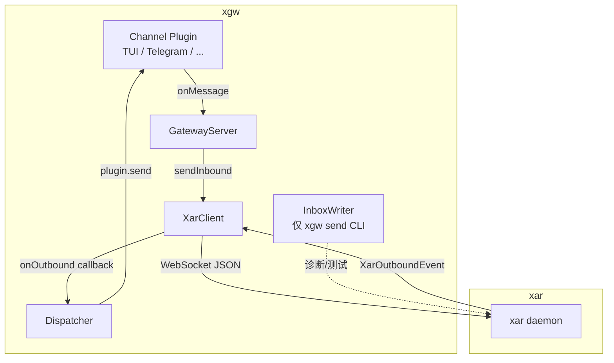
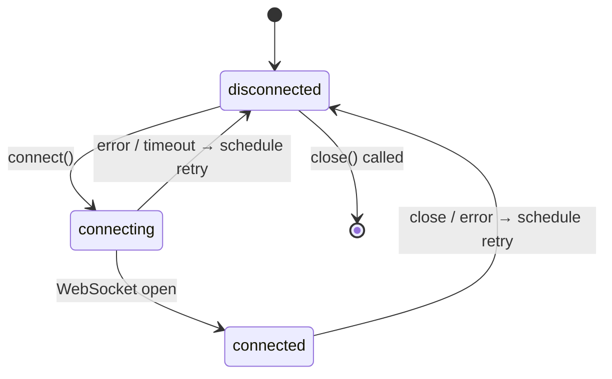

# 设计文档：xgw-xar-ipc

## 概述

本设计将 xgw 从 v1 的 CLI 子进程调用模式升级为 v2 的直接 IPC（WebSocket）通信模式。核心变化是引入 `XarClient` 模块维护到 xar 的持久 WebSocket 连接，以及 `Dispatcher` 模块将 xar 的出站流式事件路由到对应的 channel plugin。

v1 消息路径：
```
入站: channel plugin → GatewayServer → InboxWriter → thread push CLI → xar
出站: xar → agent deliver CLI → xgw send CLI → channel plugin
```

v2 消息路径：
```
入站: channel plugin → GatewayServer → XarClient → WebSocket → xar
出站: xar → WebSocket → XarClient → Dispatcher → channel plugin
```

## 架构



### 连接策略

XarClient 按以下优先级建立连接：
1. Unix socket：`ws+unix://<socket_path>`（默认 `~/.theclaw/xar.sock`）
2. TCP fallback：`ws://127.0.0.1:<port>`（默认 18792）

重连策略采用指数退避：初始间隔 `reconnect_interval_ms`（默认 3000ms），每次失败后翻倍，上限 60000ms。

## 组件与接口

### XarClient（src/xar/client.ts）

负责维护到 xar 的持久 WebSocket 连接，提供入站消息发送和出站事件订阅能力。

```typescript
class XarClient {
  constructor(config: XarConfig, logger: Logger)

  /** 建立连接，启动自动重连循环 */
  connect(): Promise<void>

  /** 发送入站消息给 xar；连接断开时缓冲 */
  sendInbound(agentId: string, message: InboundMessage): Promise<void>

  /** 注册出站事件处理器 */
  onOutbound(handler: (event: XarOutboundEvent) => void): void

  /** 关闭连接，停止重连 */
  close(): void
}
```

内部状态机：



缓冲区管理：
- 类型：`InboundEnvelope[]`（含 agentId + InboundMessage）
- 容量：最多 100 条
- 溢出策略：丢弃最旧一条，记录 warn 日志
- 恢复策略：连接恢复后按 FIFO 顺序逐条发送

### Dispatcher（src/xar/dispatcher.ts）

将 xar 推送的 `XarOutboundEvent` 路由到对应的 channel plugin。

```typescript
class Dispatcher {
  constructor(registry: ChannelRegistry, logger: Logger)

  /** 处理单个出站事件 */
  handle(event: XarOutboundEvent): void
}
```

路由逻辑：
- 从 `event.reply_context`（stream_start）或内部 session 状态（stream_token/end/error）中获取 `channel_id`
- 通过 `ChannelRegistry` 查找对应 plugin 实例
- 按渠道类型决定发送策略（见下文）

流式发送策略：

| 渠道类型 | stream_token | stream_end |
|---------|-------------|-----------|
| `tui` | 立即 `plugin.send(token)` | 无操作 |
| 其他 | 累积到 session buffer | `plugin.send(完整文本)` |

### 数据流：入站消息

```
GatewayServer.handleInbound(msg: Message)
  → 构造 InboundMessage { source, content, reply_context }
  → XarClient.sendInbound(agentId, inboundMessage)
  → WebSocket.send(JSON.stringify({ type: 'inbound_message', agent_id, ...inboundMessage }))
```

### 数据流：出站事件

```
WebSocket.onmessage(raw)
  → JSON.parse → XarOutboundEvent
  → outboundHandler(event)
  → Dispatcher.handle(event)
  → plugin.send(params) 或 buffer accumulation
```

## 数据模型

### XarConfig

```typescript
interface XarConfig {
  socket: string           // Unix socket 路径，默认 ~/.theclaw/xar.sock
  port: number             // TCP fallback 端口，默认 18792
  reconnect_interval_ms: number  // 初始重连间隔，默认 3000
}
```

config.yaml 新增节：

```yaml
xar:
  socket: ~/.theclaw/xar.sock
  port: 18792
  reconnect_interval_ms: 3000
```

### InboundMessage

```typescript
interface InboundMessage {
  source: string        // "external:<type>:<channel_id>:<session_type>:<session_id>:<peer_id>"
  content: string       // 消息文本内容
  reply_context: ReplyContext
}

interface ReplyContext {
  channel_type: string
  channel_id: string
  session_type: string
  session_id: string
  peer_id: string
  ipc_conn_id?: string  // 可选，TUI 等有连接 ID 的渠道使用
}
```

### XarOutboundEvent

```typescript
type XarOutboundEvent =
  | { type: 'stream_start';    reply_context: ReplyContext; session_id: string }
  | { type: 'stream_token';    session_id: string; token: string }
  | { type: 'stream_thinking'; session_id: string; delta: string }
  | { type: 'stream_end';      session_id: string }
  | { type: 'stream_error';    session_id: string; error: string }
```

### Config 扩展

在现有 `Config` 接口中新增可选字段：

```typescript
interface Config {
  gateway: GatewayConfig
  channels: ChannelConfig[]
  routing: RoutingRule[]
  agents: Record<string, { inbox: string }>
  xar?: XarConfig   // 新增，可选
}
```

### InboundEnvelope（内部缓冲单元）

```typescript
interface InboundEnvelope {
  agentId: string
  message: InboundMessage
  enqueuedAt: number  // Date.now()
}
```

### SessionState（Dispatcher 内部）

```typescript
interface SessionState {
  channelId: string
  channelType: string
  peerId: string
  sessionId: string
  tokenBuffer: string[]  // 非 TUI 渠道累积 token
}
```

## 正确性属性

*属性（property）是在系统所有合法执行中都应成立的特征或行为——本质上是对系统应做什么的形式化陈述。属性是人类可读规范与机器可验证正确性保证之间的桥梁。*

### 属性 1：缓冲区溢出后保留最新消息

*对于任意* 数量（N > 100）的入站消息在断连状态下依次入队，缓冲区大小不超过 100，且缓冲区中保留的是最后入队的 100 条消息（最旧的 N-100 条被丢弃）。

此属性同时覆盖了容量上限不变式（大小 <= 100）和溢出时丢弃最旧消息的行为。

**验证：需求 1.4、1.5**

### 属性 2：缓冲区恢复后 FIFO 顺序发送

*对于任意* 缓冲区中的消息序列，连接恢复后发送给 xar 的消息顺序与入队顺序（FIFO）完全一致。

**验证：需求 1.6**

### 属性 3：InboundMessage source 字段格式正确性

*对于任意* 合法的 channel_type、channel_id、session_type、session_id、peer_id 字符串组合，构造出的 `InboundMessage.source` 字段必须满足：以 `"external:"` 开头，各段以 `:` 分隔，共 6 段，且各段内容与输入参数一一对应。

**验证：需求 2.3**

### 属性 4：InboundMessage JSON 序列化往返一致性

*对于任意* 合法的 `InboundMessage`（含 source、content、reply_context 所有必填字段），将其序列化为 JSON 字符串后再反序列化，应得到与原始对象字段完全等价的值。

此属性同时验证了消息结构的完整性（需求 2.2、2.4、2.5）。

**验证：需求 2.2、2.4、2.5**

### 属性 5：stream_token 路由到正确 plugin

*对于任意* 通过 stream_start 建立的会话（含 channel_id），Dispatcher 处理后续 stream_token 事件时，调用的 plugin 实例必须与 stream_start 中 reply_context.channel_id 所对应的 plugin 一致。

**验证：需求 3.1、3.5**

### 属性 6：TUI 渠道每个 token 立即发送

*对于任意* TUI 渠道会话中的 N 个 stream_token 事件，Dispatcher 处理完这 N 个事件后，plugin.send 恰好被调用 N 次，每次调用的 text 参数等于对应 token 的内容。

**验证：需求 4.1**

### 属性 7：非 TUI 渠道 token 累积后完整发送

*对于任意* 非 TUI 渠道会话中的 token 序列（stream_start → N 个 stream_token → stream_end），Dispatcher 在 stream_end 之前不调用 plugin.send，在 stream_end 时恰好调用一次 plugin.send，且 text 参数等于所有 token 按顺序拼接的完整字符串。

**验证：需求 4.2**

### 属性 8：XarConfig 默认值正确性

*对于任意* 省略了部分或全部字段的 xar 配置对象，经过默认值填充后，缺失的 socket 字段值为 `~/.theclaw/xar.sock`，port 字段值为 18792，reconnect_interval_ms 字段值为 3000。

**验证：需求 5.2、5.3、5.4**

### 属性 9：XarConfig YAML 解析往返一致性

*对于任意* 合法的 `XarConfig` 对象，将其序列化为 YAML 字符串后再解析回来，应得到与原始对象字段完全等价的值。

**验证：需求 5.1、5.5**

## 错误处理

| 场景 | 处理方式 |
|------|---------|
| xar 连接失败（Unix socket） | 回退到 TCP，记录 warn |
| xar 连接断开 | 启动指数退避重连，缓冲入站消息 |
| 缓冲区溢出 | 丢弃最旧消息，记录 warn（含丢弃数量） |
| 重连成功 | 记录 info，刷新缓冲区 |
| Dispatcher 找不到 plugin | 记录 warn，丢弃事件 |
| WebSocket 收到非法 JSON | 记录 error，跳过该消息 |
| config.yaml xar 节格式错误 | 返回描述性错误，阻止启动 |
| xar 永久不可用 | xgw 继续运行，持续重连，不退出 |

## 测试策略

### 单元测试（vitest/unit/）

- `xar-client.test.ts`：连接逻辑、重连行为、缓冲区管理（容量上限、溢出丢弃、恢复后刷新）
- `dispatcher.test.ts`：事件路由、TUI 实时发送、非 TUI 累积发送、plugin 不存在时的降级
- `config.test.ts`：xar 节解析、默认值填充、格式错误处理

### 属性测试（vitest/pbt/）

使用 `fast-check` 库，每个属性测试最少运行 100 次迭代。

- `xar-client.pbt.test.ts`：
  - 属性 1：缓冲区溢出后保留最新消息
  - 属性 2：缓冲区恢复后 FIFO 顺序发送
  - 属性 3：InboundMessage source 字段格式正确性
  - 属性 4：InboundMessage JSON 序列化往返一致性
- `dispatcher.pbt.test.ts`：
  - 属性 5：stream_token 路由到正确 plugin
  - 属性 6：TUI 渠道每个 token 立即发送
  - 属性 7：非 TUI 渠道 token 累积后完整发送
- `config.pbt.test.ts`：
  - 属性 8：XarConfig 默认值正确性
  - 属性 9：XarConfig YAML 解析往返一致性

每个属性测试注释格式：
```typescript
// Feature: xgw-xar-ipc, Property 1: 缓冲区容量上限不变式
```

### 测试原则

- 单元测试：覆盖具体示例、边界条件、错误路径
- 属性测试：验证跨输入的普遍正确性
- 两者互补，共同保证覆盖率
- WebSocket 连接在单元测试中使用 mock（不依赖真实 xar 进程）
